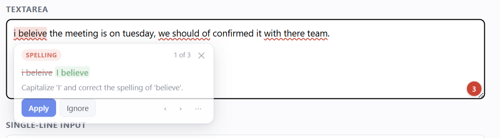

# Blue Pencil

A Chrome extension that proofreads every text box in your browser, the way Grammarly
does — except the suggestions come from your own [Ollama](https://ollama.com) server.
Pick a downloaded model and nothing you type ever leaves your machine.



## What it does

- Watches whatever field you are typing in — `<input>`, `<textarea>`, and rich
  editors built on `contenteditable` (Gmail, Slack, GitHub, Notion-style editors).
- When you pause, it asks your local model for corrections and underlines them in
  place: red for spelling, grammar and punctuation; blue for style and clarity.
- Click an underline (or the pencil badge on the field) for a card explaining the
  problem, with **Apply** and **Ignore**.
- Rewrite the whole field or just your selection: fix errors, improve, shorten, make
  it formal, make it friendly. You see the result before it replaces anything.
- Applied fixes go through the browser's own editing pipeline, so **Ctrl+Z undoes
  them** and React-based editors notice the change.

## Requirements

- Chrome 116 or newer.
- Ollama running locally with at least one model pulled:

  ```sh
  ollama pull llama3.2      # quick and good enough for proofreading
  ollama pull qwen2.5:7b    # a little sharper
  ```

  Any instruct-tuned model works. 7B–12B is the sweet spot: large enough to judge
  grammar, small enough to answer in a second or two.

## Choosing a model

The model dropdown, in settings and in the toolbar popup, lists two groups:

- **Downloaded — runs on this machine.** Everything in `ollama list`. Your text goes
  to `localhost` and no further.
- **Ollama Cloud — runs on Ollama's servers.** The full catalogue Ollama hosts, from
  `gpt-oss:20b-cloud` up to `kimi-k3:cloud`. Choosing one sends the text you are
  editing to Ollama to be processed; the settings page says so in amber whenever a
  cloud model is selected.

Cloud models need `ollama signin` — the settings page tells you if you are not signed
in. There is nothing to pull: Ollama resolves a `-cloud` model on first use. In
practice a cloud model is both faster and sharper than a mid-size local one, at the
cost of your text leaving the machine, so pick whichever trade you want.

The catalogue comes from `https://ollama.com/api/tags`, the one request Blue Pencil
makes to the internet, cached for six hours. Turn off **Offer Ollama Cloud models** in
settings and it is never fetched — the extension then only ever talks to `localhost`.

## Install

1. Open `chrome://extensions`.
2. Turn on **Developer mode** (top right).
3. Click **Load unpacked** and choose this folder.
4. The settings page opens. It should already say *Connected to Ollama* and have
   picked a model. Use **Try it** on that page to confirm suggestions come back.

## Ollama and the Origin header

Ollama refuses requests that carry a browser-extension `Origin` header, which is why
most extensions ask you to restart the server with `OLLAMA_ORIGINS` set. Blue Pencil
avoids that: a `declarativeNetRequest` rule strips the `Origin` header from its own
requests to your Ollama endpoint, and nothing else. The rule is scoped to requests
with no tab (only the extension's service worker makes those).

If you still get a 403 — an unusual proxy in front of Ollama, say — start Ollama with:

```sh
OLLAMA_ORIGINS="chrome-extension://*" ollama serve
```

## Keyboard

| Shortcut | Action |
| --- | --- |
| `Alt+Shift+B` | Check the field you are in right now |
| `Alt+Enter` | Apply the suggestion on screen |
| `Alt+↓` / `Alt+↑` | Move between suggestions |
| `Esc` | Dismiss the card |

`Alt+Shift+B` can be changed at `chrome://extensions/shortcuts`.

## What it will not touch

- Password fields, and inputs whose `autocomplete` or `name` looks like a card
  number, CVC or one-time code.
- Code editors: CodeMirror, Monaco, Ace.
- Anything inside `[data-blue-pencil="off"]`, and it honours Grammarly's
  `[data-gramm="false"]` opt-out too.
- Sites on your off-list, which you can add from the field menu ("Turn off on …")
  or the settings page.

## Settings worth knowing

- **Check as I type** — turn it off to make every check manual (`Alt+Shift+B` or the
  field button). Nothing is sent to the model until you ask.
- **Categories** — turn off Style and Clarity if you only want hard errors.
- **Standing instructions** — given to the model on every check, e.g. *"I write in
  lowercase on purpose"* or *"never change my em dashes"*.
- **Keep the model loaded for** — Ollama unloads an idle model. The default 30
  minutes keeps checks fast; shorten it if you are tight on memory.
- **Thinking effort** — how long the model reasons before answering: off, low,
  medium, high, or whatever the model does by default. Off is the default, because
  reasoning is by far the slowest part of a check and proofreading seldom needs it.

  Raise it only if your model misses mistakes, and check the effect in **Try it**
  first — models differ wildly. `glm-5.3-flash:cloud` handles every level in 1.5–5s.
  `gemma4:12b` ignores the level entirely and, whenever reasoning is allowed at all,
  spends about **130 seconds** producing ~29,000 characters of working and then no
  usable answer. When that happens Blue Pencil silently retries with thinking off,
  so you still get suggestions — just slowly. Off is the right setting for it.

The first check after a model has been unloaded waits for it to load, which can take
a minute or more for a large model. Blue Pencil preloads the model as soon as you
focus a text field, so that wait usually overlaps with your typing.

## How it works

```
content script            service worker              Ollama
──────────────            ──────────────              ──────
watches the focused
field, debounces
       │  text
       └──────────────────▶ builds the prompt,
                            POST /api/chat with a
                            JSON schema ───────────────▶ model
                            parses the edits ◀───────────┘
       ◀──────────────────┘ {before, after, category, reason}
re-finds each "before"
verbatim in the live text,
underlines what matches
```

The model never returns character offsets — models are bad at counting. It returns
the exact text to replace, and the content script re-finds that text in the field as
it is *right now*. An edit that cannot be found verbatim is discarded rather than
guessed at, and an edit still lands correctly if you kept typing while the model was
thinking.

All network calls happen in the service worker, which holds the `localhost` host
permission. Content scripts cannot reach `localhost` from an `https` page.

The only other host Blue Pencil is permitted to contact is `ollama.com/api/tags`, for
the cloud model list — never for your text, which always goes to your own server.

## Layout

```
manifest.json
src/
  lib/
    defaults.js        settings, defaults, rewrite presets (loaded everywhere)
    prompt.js          system prompts and the JSON schema for edits
    ollama.js          HTTP client: /api/chat, /api/tags, /api/generate preload
  background/
    service-worker.js  all Ollama traffic, caching, request cancellation
  content/
    util.js            the anchoring engine: model edits → verified text spans
    editor.js          one interface over input/textarea/contenteditable
    highlight.js       underlines: mirror overlay for inputs, CSS Custom
                       Highlight API for rich editors
    ui.js              the field button, suggestion card and rewrite panel
    main.js            orchestration
  options/, popup/, ui/
icons/
```

There is no build step. Every file is a plain classic script that attaches to a
shared `BP` global, so the service worker (`importScripts`), the extension pages
(`<script src>`) and the content script all load the same sources.

## Troubleshooting

**"Cannot reach Ollama"** — is it running? `curl http://localhost:11434/api/version`.
On Windows and macOS the desktop app starts the server for you.

**"Ollama refused the request (403)"** — see the Origin section above.

**Suggestions are slow** — check which model is selected in the popup. A 12B model on
CPU takes several seconds per check; a 3B model is usually under a second.

**Nothing is underlined but the badge says the check ran** — the model returned edits
that could not be found verbatim in your text, so they were discarded. The **Try it**
box on the settings page reports how many were dropped; a different model usually
fixes it.

**"The model did not return a usable answer"** — the reply could not be read as JSON,
even after a retry with thinking allowed. Reasoning models are the usual cause: their
working is meant to stay in a separate field but sometimes lands in the answer. Blue
Pencil strips that when it can. If one model keeps doing it, pick another.

**A site's editor behaves oddly** — add it to the off-list from the field menu, or add
a CSS selector under *Skip elements matching* in settings.
